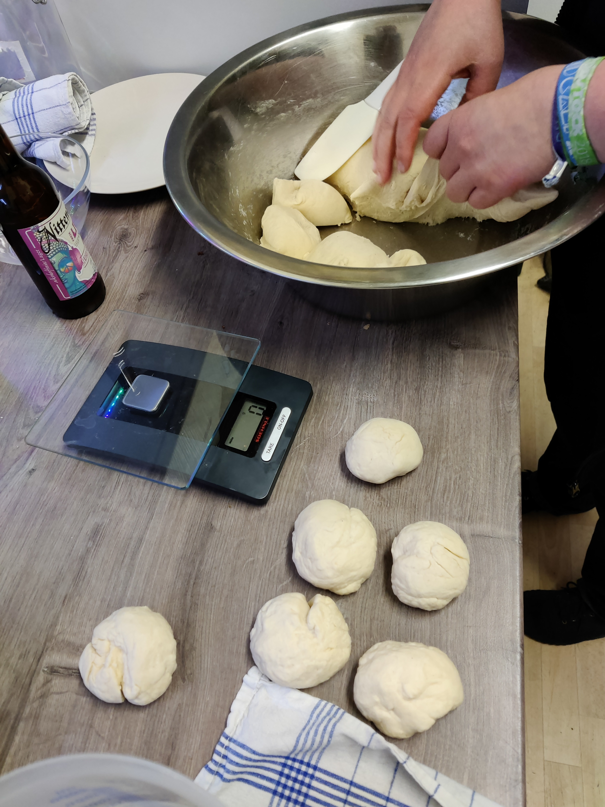
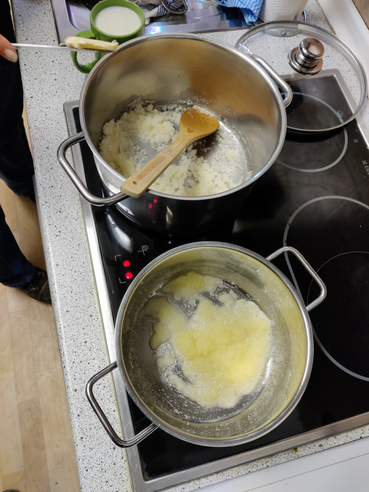
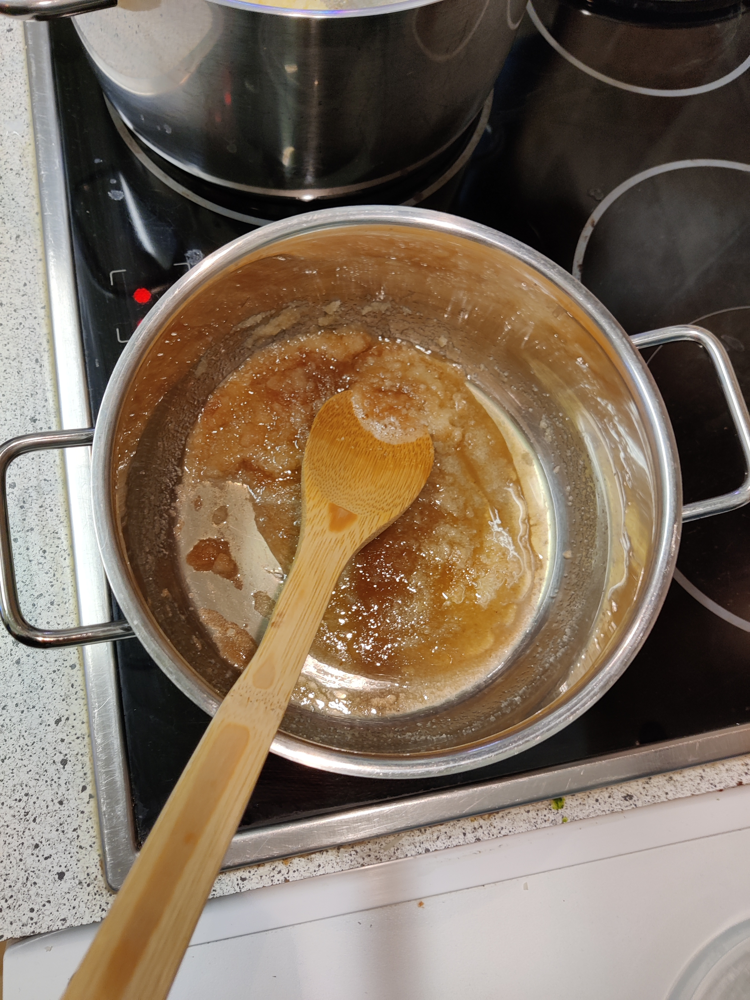
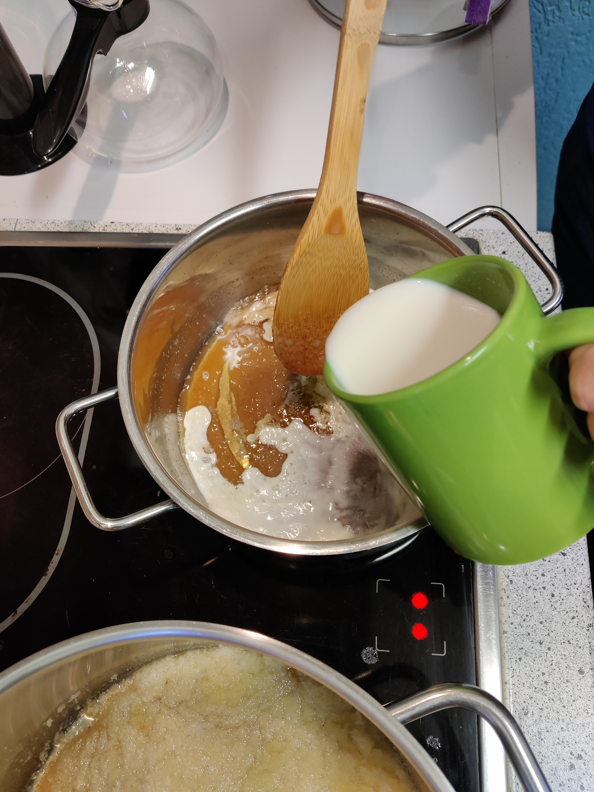
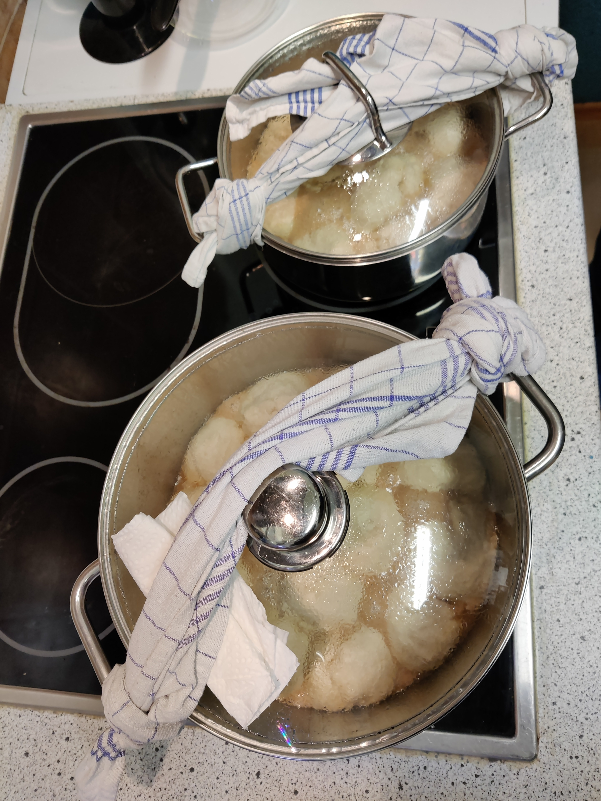
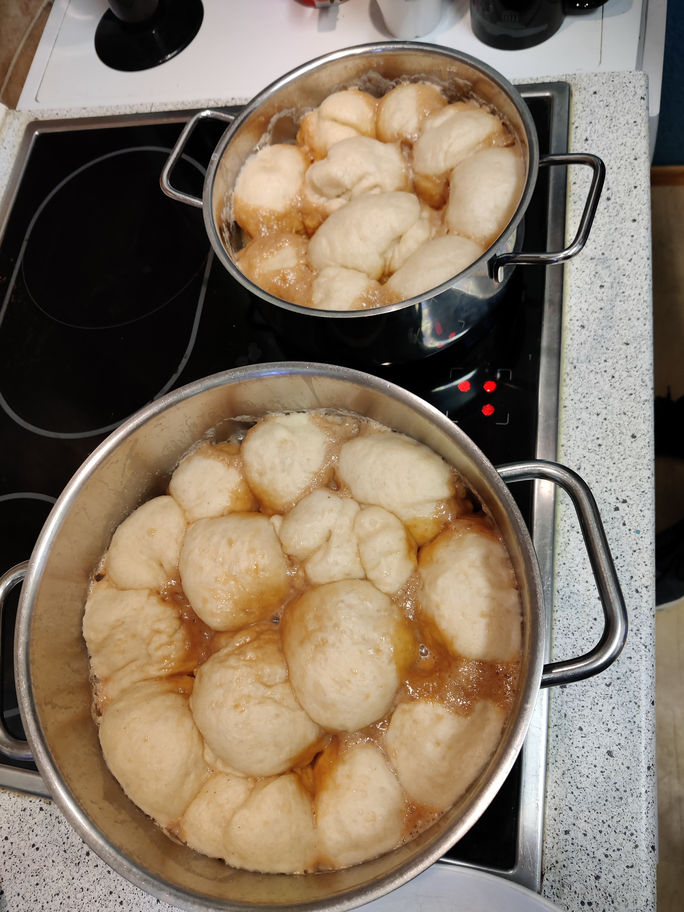

# 24 Dampfnudeln (zB für einen Abend in der Kitchen)

nach einem Rezept von cb

### Menge
Für 1..24 Personen

## tl;dr
Hefeteig herstellen und in einer Karamellsoße dünsten.

### Dauer
* Gesamtdauer: 1:30h
  * Arbeitszeit: 0:30h
  * Kochzeit: 0:30h
  * Wartezeit: 0:30h

## Werkzeug
* Topf mit Glasdeckel [2 Stück]
* Herdplatte mit Stufeneinteilung 1..9 [2 Stück]
* Kochlöffel oder Schneebesen

## Zutaten
### Nudeln
* Mehl [1kg]
* Milch [0,6l]
* Butter [50g]
* Hefe [1 Würfel]
* Zucker [48g]
* Salz [~1g]

### Karamell
* Butter [100g]
* Zucker [200g]
* Milch [500ml]

## Anleitung

### Hefeteig
1. Hefeteig mit obigen Zutaten nach allgemeinem Hefeteigrezept (siehe Internet) herstellen.
1. Im Serverraum gehen lassen (Der wärmste Ort ist oben auf dem Serverrack)
1. Zu 24 kleinen Bällen formen. Dazu Teig in drei Teile teilen und dann durch 3x wiederholtes Halbieren 24 gleich große Kugeln formen
1. Der Volumenverlusst beim Formen ist hinzunehmen
1. 

### Karamell
1. Herd auf Stufe 7..9 stellen
1. Butter im Kopf verflüssigen
1. 
1. Zucker eingießen, dabei heftig mit dem Schneebesen rühren. Der Zucker wird sich erst schwer in der Butter lösen, aber dann selbst schmelzen. Die Schmelze ist sehr heiß (nicht ungekühlt probieren) und wird sich braun einfärben (Maillard-Reaktion). Je brauner, desto geschmacklich intensiver wird die Soße werden, manchen ist es dann zu bitter. Daher kann durchaus zwischendrin probiert werden. Nicht über 180°C erhitzen, weil sich sonst der Zucker zersetzt. 
1. 
1. Milch in der Mikrowelle vorwärmen und langsam hinzugeben. Es zwischt und sprudelt. Dabei heftig rühren. Der Zucker wird zu festen Klumpen werden. Weiter Rühren (5min oder mehr) bis er sich wieder aufgelöst hat. Zieltiefe der Karamellsose im Topf 7..10mm. Alternativ kann die Milch auch schnell hinzugefügt werden, dann wird es heftigst Sprudeln. Extreme Gefahr durch heiße Spritzer, die heißer sind als kochenendes Wasser, aber es bilden sich keine Klumpen
1. 
1. 
1. 
1. Herd auf Stufe 2 stellen
1. Nudeln in die Soße setzen, dicht an dicht 
1. 
1. Glasdeckel auf den Topf mit einem Geschirrtuch binden, damit andere Anwesende den Deckel nicht öffnen. 
1. 
1. 30min ungestört dünsten lassen, ca. 95°, erkennbar daran, dass die Karamellsoße zwischen den Nudeln leicht blubbert. 
1. Das Garende ist erreicht, wenn die Nudeln nicht weiter wachsen oder gegen den Glasdeckel drücken. Ein Durcktest kann druchgeführt werden, kann sich aber negativ auf das Ergebnis auswirken. Daher erst gegen Ende durchführen. Falls die Nudeln noch nicht fest genug sind, aber die Karamellsoße bereits aufgesogen wurde und die Gefahr besteht, dass die Unterseite gleich anbrennt, kann von oben auch Milch nachgegossen werden. Das verlängert die Garzeit und rettet das Gericht vor dem Anbrennen.
1. 

Optische Kontrolle durch den Glasdeckel möglich, das Öffnen des Deckels während des Garvorgangs stört die Vergrößerung erheblich. Vanillesoße als Addon möglich
