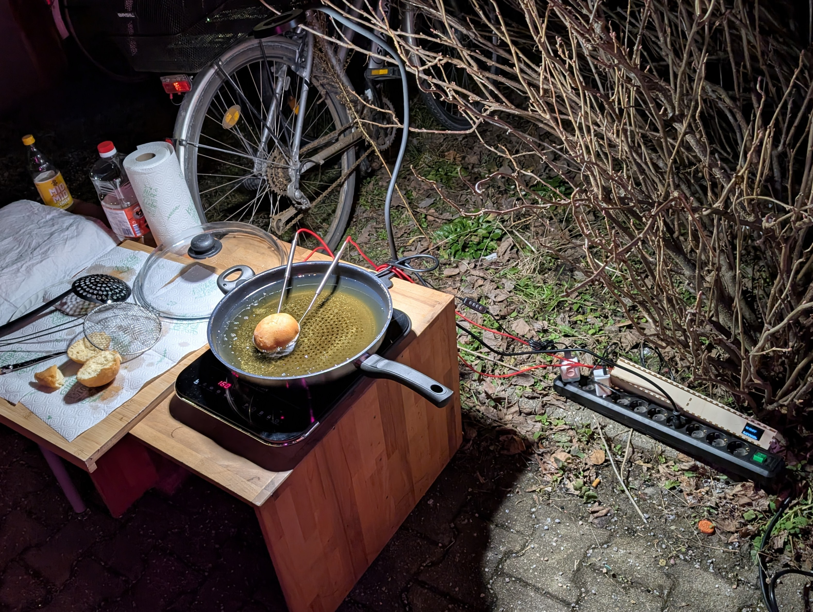
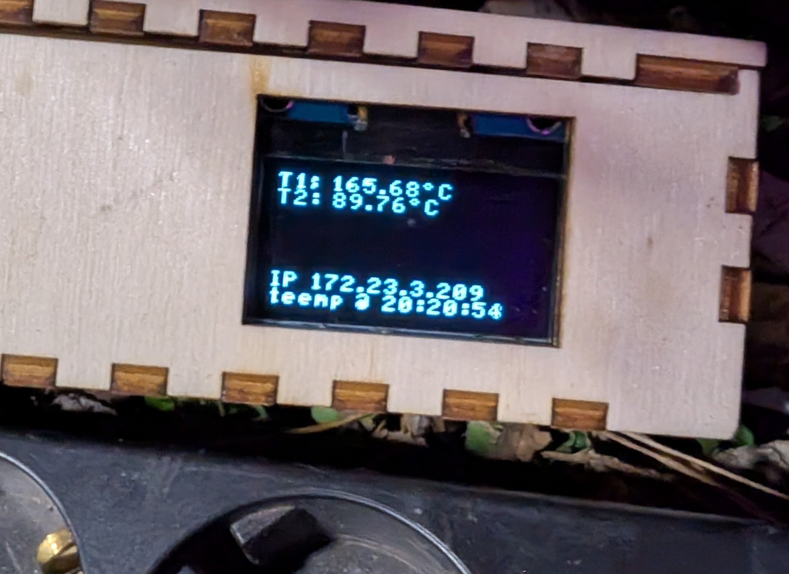
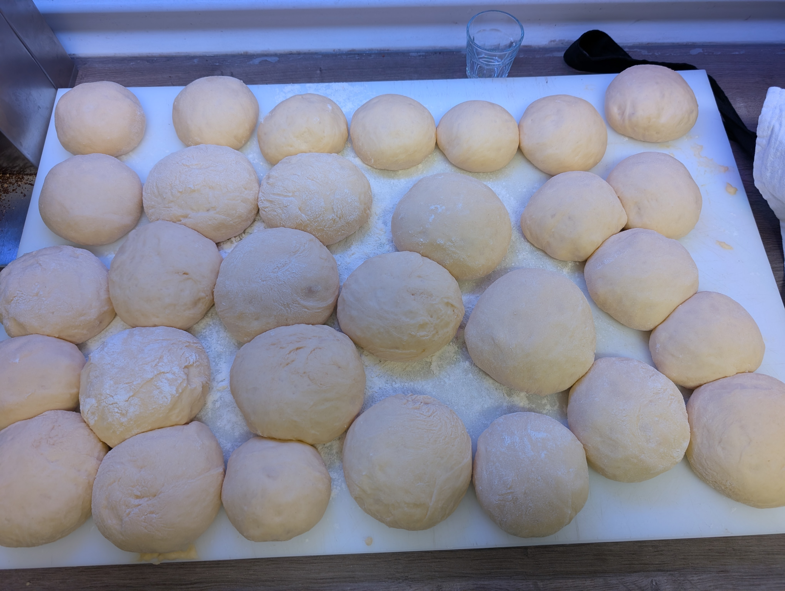
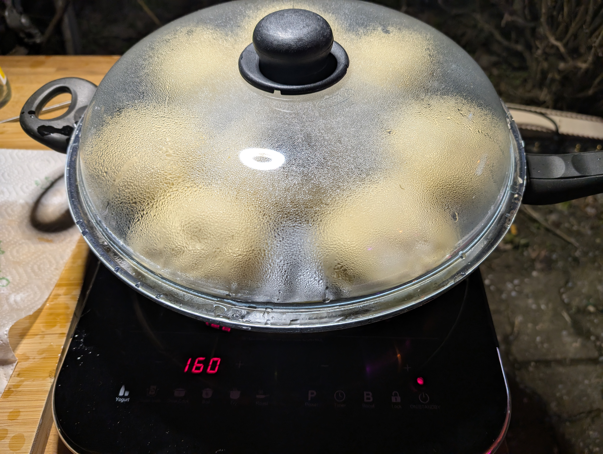
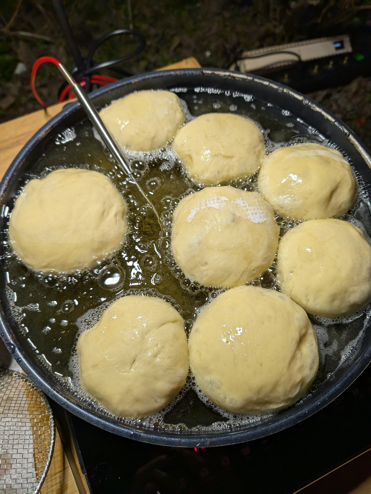
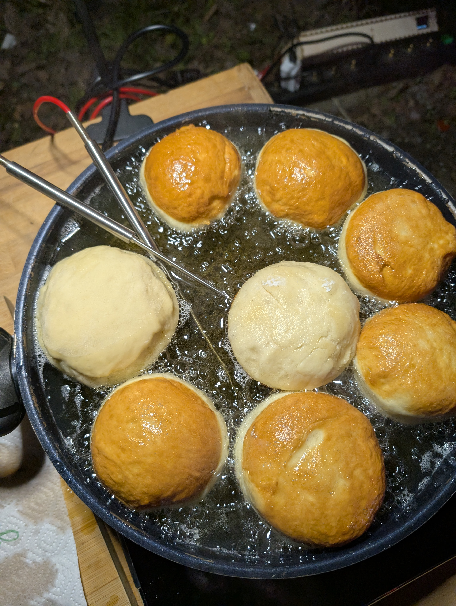
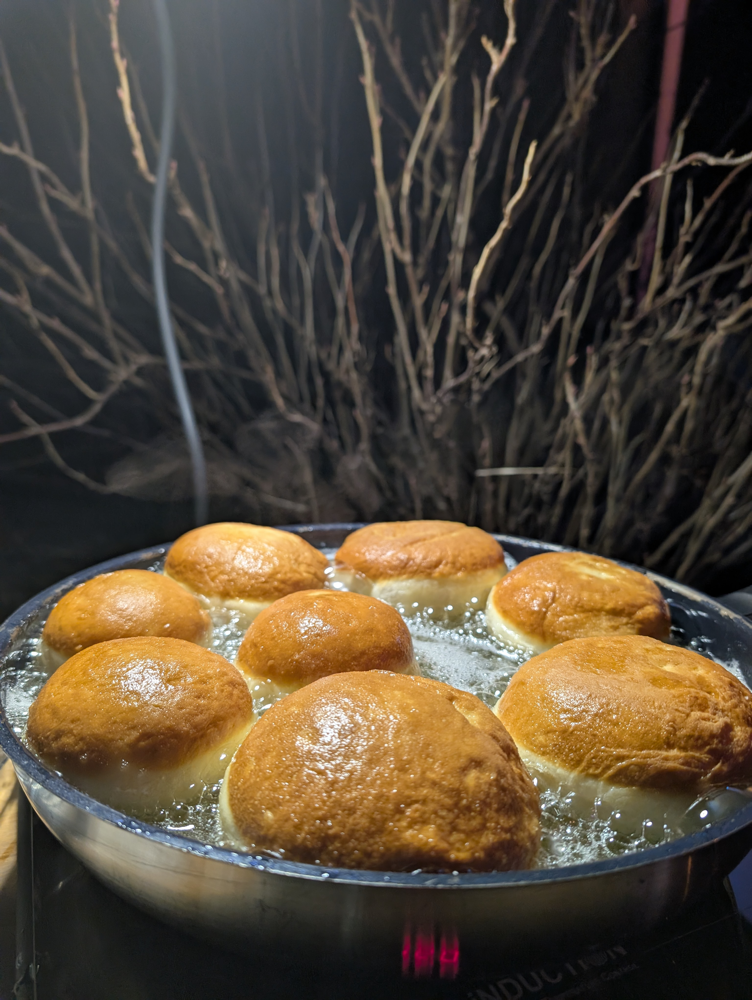
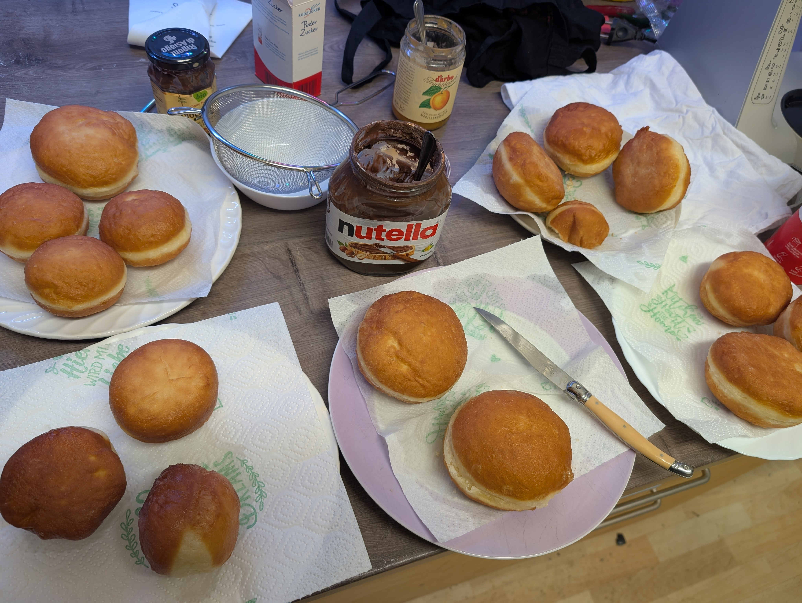

# 32 Krapfen (zB für einen Abend in der Kitchen)

Beta Version. Lernt aus meinen Fehlern (siehe Ende)

### Menge
Für 32 Krapfen

## tl;dr
Hefeteig herstellen und in Fett ausbacken.
Viel Zeit zum Aufräumen und entfetten einplanen

### Dauer
* Gesamtdauer: 3:00h
  * Vorbereitungszeit: 1:00h
  * Kochzeit: 1:00h
  * Wartezeit: 1:00h

## Werkzeug
* Topf mit Glasdeckel
* Herdplatte (draußen, Fettgeruch) mit Temperatureinstellung
  * im Beispiel: Rommelsbacher Einzelkochplatte CTS 2000/IN Induktion mit Topfbodentemperatursensor hält das Öl auf 165°C bei einem Setzpunkt von 160° mit einer Schwankung von <1°C
* Schaumlöffel
* Messer
* Temperatursensoren, Steckerleiste, Klemmlampe, Tisch, Küchenpapier
  * Die Temperatursensoren loggen via ESPEasy und MQTT den Garverlauf in eine InfluxDB, kann am Bildschirm der Telefonzelle abgelesen werden: [zelle.binary-kitchen.de](zelle.binary-kitchen.de)

Im Bild: Temperatursensor in Öl und im Teigling.

Öltemperatur (setpoint: 160°C, gemessen 165°C)
Teiglinginnentemperatur nach 7min in Öl: 90°C

## Zutaten
### Teiglinge
* Mehl (Typ 405) [1kg]
* Milch [0,5l]
* Butter [80g]
* Hefe [1,5 Würfel]
* Zucker [80g]
* Salz [~10g]
* Ei [8pc]
  * nur Eigelb verwenden
  * wenn auch das Eiweiß hinzugegeben wird, wird der Teig zu klebrig und muss mit zusätzlichen 250g Mehl geglättet werden
* Zitronenschale. Hatte ich nicht da
* Angeblich 4cl Rum hinzufügen. Soll angeblich die Fettaufnahme reduzieren. Konnte ich nicht feststellen

### Fett
* 2l Frittieröl
  * Nach dem Frittieren wird ~70% des Öls übrig bleiben. In ein Gefäß füllen und kalt über den Hausmüll entsorgen
  * Öl wird verbranntes Mehl enthalten, sollten aus geschmacklichen Gründen nicht wieder verwendet werden

### Füllung
* Marillenröster [400g]
* Puderzucker [50g]
* Nutella [wers mag]

## Anleitung

### Hefeteig
1. Hefeteig mit obigen Zutaten nach allgemeinem Hefeteigrezept (siehe Internet) herstellen.
1. Im Serverraum gehen lassen (Der wärmste Ort ist oben auf dem Serverrack)
  * 30min gehen lassen
  * Durchkneten
  * 15min gehen lassen (Teig wird angeblich feinporiger)
1. Zu 32 kleinen Bällen formen. Dazu Teig in drei Teile teilen und dann durch 5x wiederholtes Halbieren 32 gleich große Kugeln formen. Viel Mehl an den Händen und auf der Arbeitsfläche verwenden. Dieser Prozess ist zeitaufwendig, klebrig und potentiell frustrierend
1. Flachdrücken
1. Abgedeckt unter einem Geschirrtuch gehen lassen
1. 
Gut sichbar: Schlechte Teilung. Die Kugeln sollten ungefähr gleich groß sein

### Frittieren
Bei 8 Krapfen pro Pfanne: 4 Durchgänge. Mit den Testkrapfen eher 5 à 10min = 1h+ Zeit einplanen
1. Herd raus und auf 160°C stellen
1. Öl erhitzen
1. 
1. Teiglinge einlegen und zudecken für die erste Hälfte
1.  0min
1.  5min: Zeit zur Wende. Danach offen weiter frittieren.
1.  10min: Innentemperatur erreicht 105°C
Die ersten Krapfen opfern und halbieren. Prozesskontrolle der Frittierzeit durchführen. Im Inneren sollte der Teig durchgegart sein
1. 
Auf Küchenpapier das Fett entziehen. Zum Füllen eine Spritze verwenden. Leider hatten wir keine Spritze, daher haben wir sie halbiert und mit Marillenröster bestrichen, mit Puderzucker bestäubt

### Geschmacklich
1. recht fettig im vgl zum Bäcker
1. hefiger im bgl zum Bäcker

### Verbesserungspotential
* Weniger Flüssigkeit / Mehr Mehl verwenden beim Teig kneten
* Weg finden, dass sie weniger Fett aufsaugen. Evtl Öltemperatur auch 175°C erhöhen
* Weniger Hefe verwenden, dafür längere Gehzeit, um den Hefegeschmack zu reduzieren